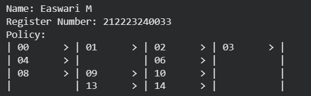
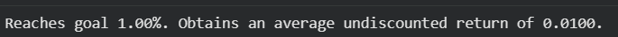
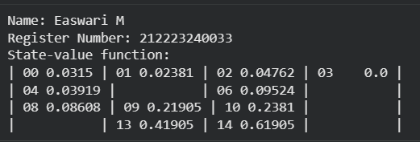
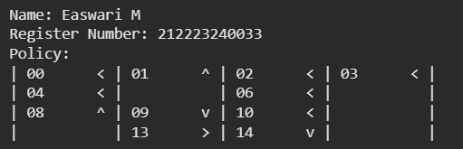
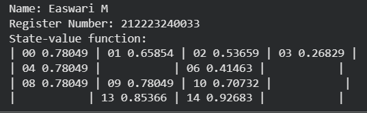
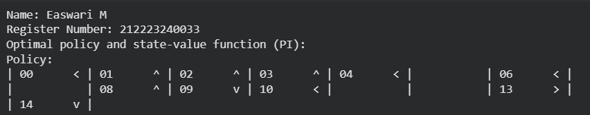
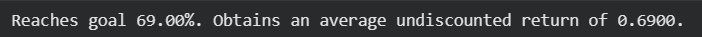
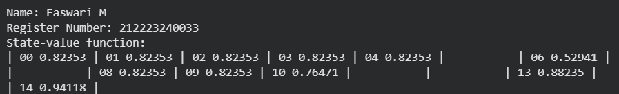

# POLICY ITERATION ALGORITHM

## AIM
To implement a policy iteration algorithm for finding the  optimal policy by iteratively maximizing the value function.

## PROBLEM STATEMENT
This experiment aims to find the optimal strategy for a Markov Decision Process (MDP) by using the Policy Iteration algorithm. Policy iteration involves two  stages: assessing the current policy and enhancing it-policy Iteration and policy Improvement. During the policy assessment phase, we compute the value of each state under the existing policy. Subsequently, the policy enhancement phase involves comparing action-value functions to refine and establish the most advantageous policy for the MDP.

## POLICY ITERATION ALGORITHM
</br>
Step -1 : Start with an arbitrary initial policy.
Step -2 : Evaluate the current policy to determine the value function V.
Step -3 : Improve the policy based on the calculated value function V.
Step -4 : Repeat policy evaluation and improvement until the policy stabilizes.
Step -5 : Printthe optimal policy and its value function found through policy iteration.
</br>

## POLICY IMPROVEMENT FUNCTION
### Name : Easwari M
### Register Number: 212223240033
```
def policy_improvement(V, P, gamma=1.0):
    Q = np.zeros((len(P), len(P[0])), dtype=np.float64)
    
    for s in range(len(P)): 
        for a in range(len(P[s])): 
            for prob, next_state, reward, done in P[s][a]:
                Q[s, a] += prob * (reward + gamma * V[next_state] * (not done))
    
    new_pi = lambda s: np.argmax(Q[s, :])

    return new_pi
```
## POLICY ITERATION FUNCTION
### Name : Easwari M
### Register Number: 212223240033
```
def policy_iteration(P, gamma=1.0, theta=1e-10):
    n_states = len(P)
    n_actions = len(P[0]) 
    pi = lambda s: 0

    while True:
        V = policy_evaluation(pi, P, gamma, theta)
        new_pi = policy_improvement(V, P, gamma)
        policy_stable = True
        for s in range(n_states):
            if new_pi(s) != pi(s):
                policy_stable = False
                break

        if policy_stable:
            break
        else:
            pi = new_pi 

    return V, pi
```

## OUTPUT:
### 1. Policy, Value function and success rate for the Adversarial Policy
</br>






</br>

### 2. Policy, Value function and success rate for the Improved Policy
</br>





</br>

### 3. Policy, Value function and success rate after policy iteration
</br>




</br>


## RESULT:

Thus the experiment has been successfully implemented.
